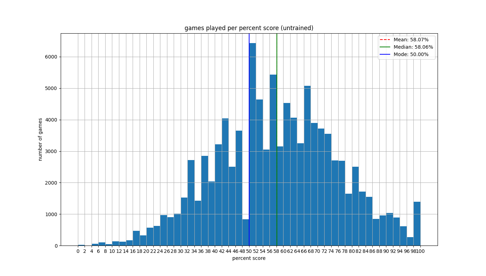
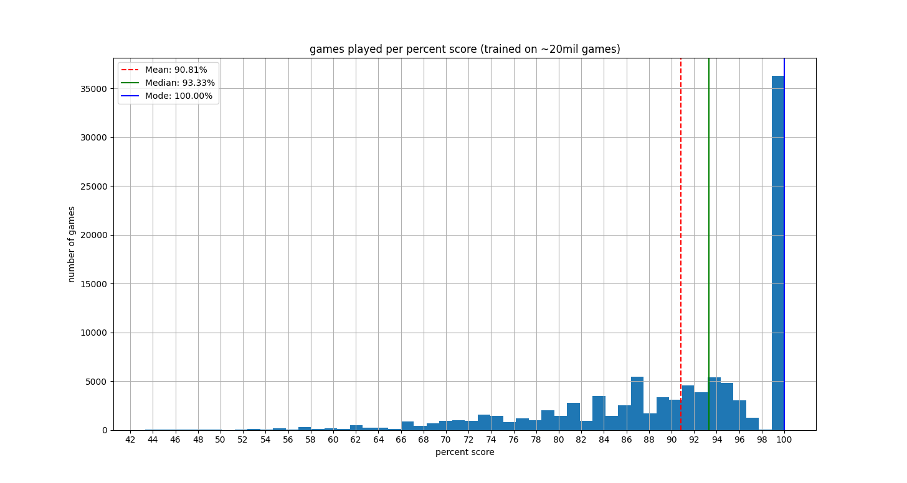
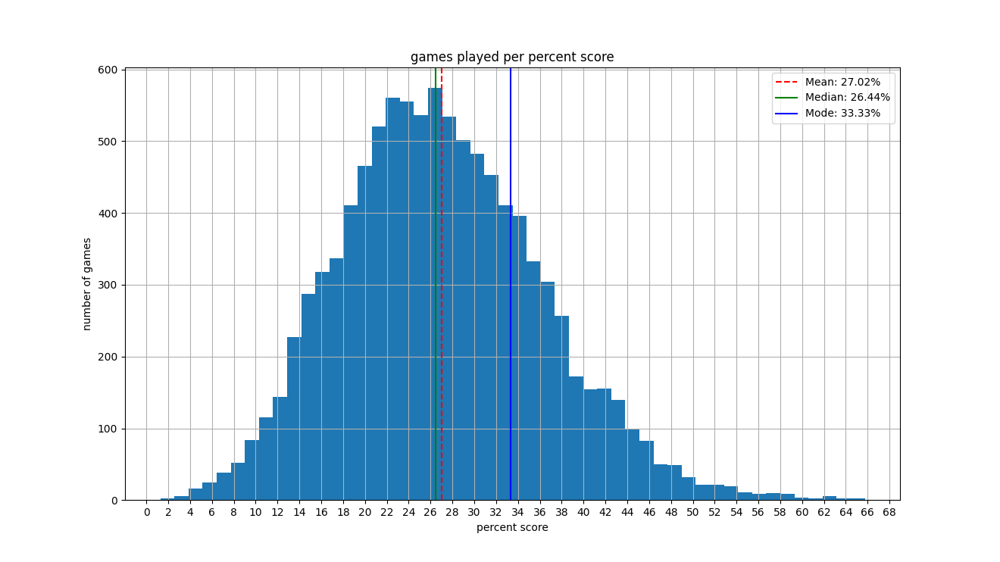
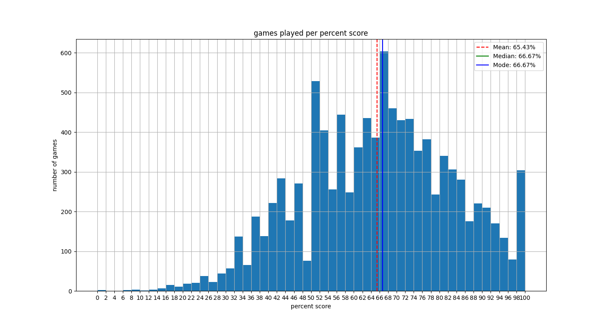
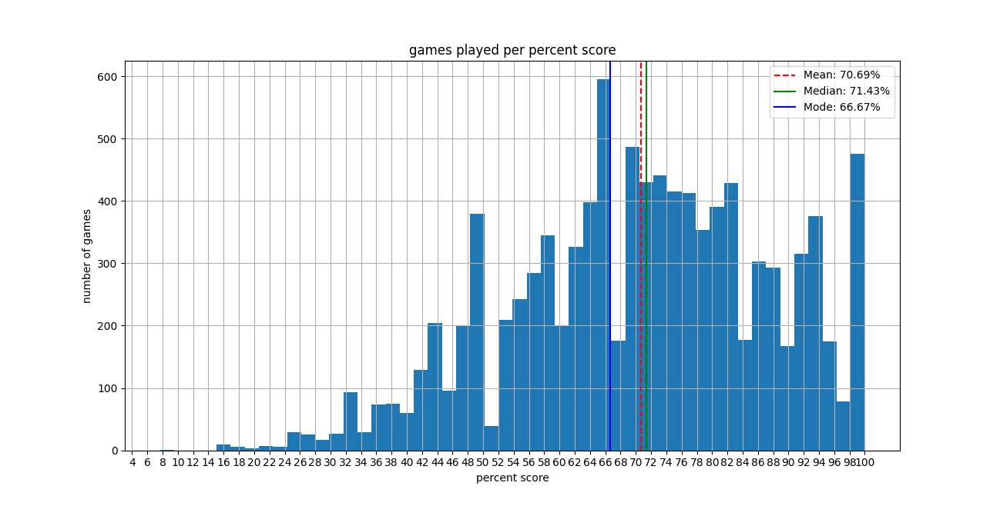

# Digit Party training writeup

Digit party as a game scales with complexity very very quickly, simply because of the number of available actions, as well as the number of possible digits. Because of this, I started with training a 3x3 game instead of the full 5x5 game that I first played.

## Simple Q-learning

### 3x3

For the 3x3 game, this works reasonably well. For a totally untrained agent (placing digits randomly), here's the distribution of scores over about ~100,000 games:

After training the simple q-agent on about 20,000,000 games, here is the resulting distribution:

While this is an impressive result, the resulting policy file is nearly 5 gigabytes, and for that reason I haven't uploaded it or stored it anywhere.

### 5x5

For the 5x5 game, using simple q-learning is pretty much intractable. There are just far too many state-action pairs to keep track of in a single policy file. It's theoretically doable, but I would need a lot of compute and memory to handle the training. I also think that it would take a few orders of magnitude more than 20,000,000 episodes to achieve a similar result as in the 3x3 case. Here's the distribution of scores of an untrained agent playing about 10,000 5x5 games:

## Deep Q-learning

Here's where deep q-learning comes into play. The idea is that after training, the neural network can output very similar policies that result from simple q-learning, but without all that memory overhead. This is still a work in progress to find the proper neural network architecture and hyperparameters.

### 3x3

#### Guessing a neural network architecture

I started with guessing some architecture and hyperparameters for the neural network, but found that while training, it was totally overfitting, and not learning properly at all. In many cases, the agent would have to fall back to a random action because the action it chose was actually invalid. So essentially, even after training, the agent wasn't much better than a random agent.

#### Finding optimal hyperparameters

Luckily, after training a simple q agent to play the 3x3 game, I have nearly 5 gigabytes of objective training data that can be used search for optimal hyperparameters. I "chunked" the 5 gigabytes of training data into 1000 chunks, and using 1% (10 chunks) to run a bayesian optimization algorithm to find optimal hyperparameters for the network. These hyperparameters were much better than my original guess at the network architecture and hyperparameters, though it's still not perfect.

For one agent, I took the training data from each of the 1000 chunks, and trained the neural network on each chunk incrementally. Here's the result of that agent playing 10,000 games:

For another agent, I trained it with the whole set of training data (all 1000 chunks). (However, I only ran it through 10 epochs, though the hyperparameters I found recommended 42 epochs. Training locally isn't very resilient, so there's possibility of it glitching out during training, without saving the neural network weights.) Here's the result of that agent playing 10,000 games:

Both agents clearly do better (averaging 70% score) than a totally untrained agent (which averages 50% score), though it still fails to live up to the agent trained with the simple q-learning method.

#### Back to deep Q-learning

The resulting hyperparameters are much more promising, so now I try to use them for the deep q-learning algorithm.
