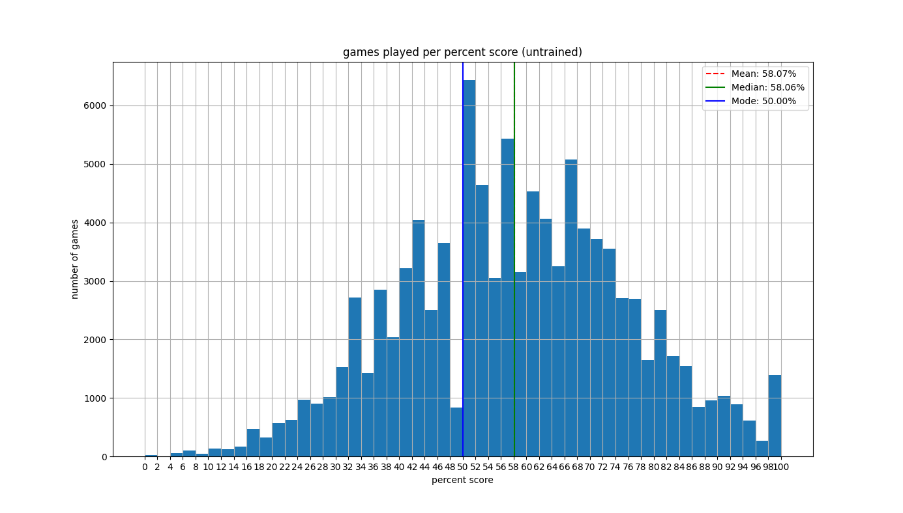
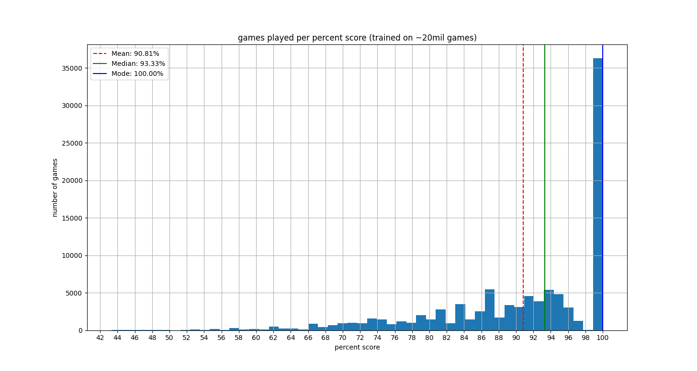
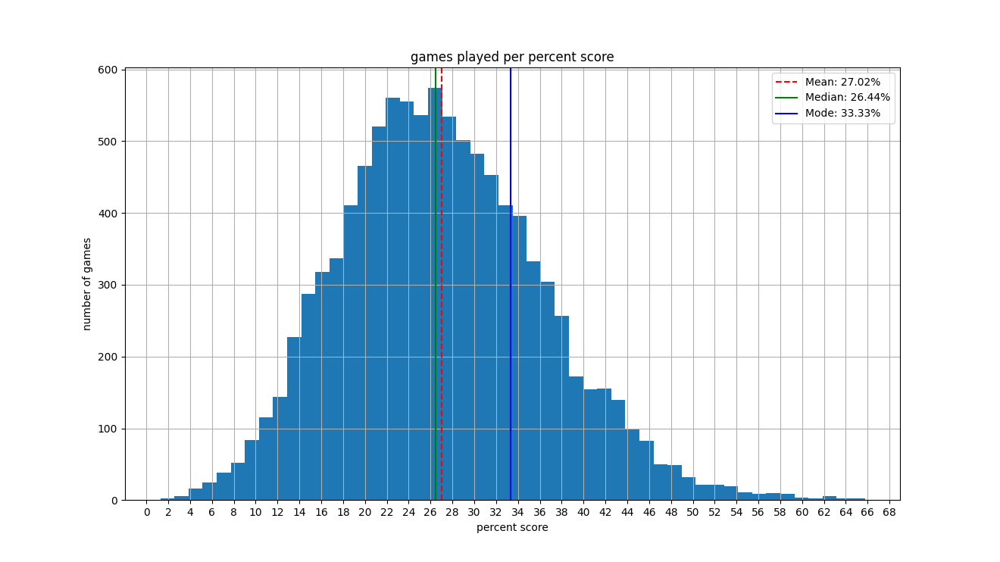
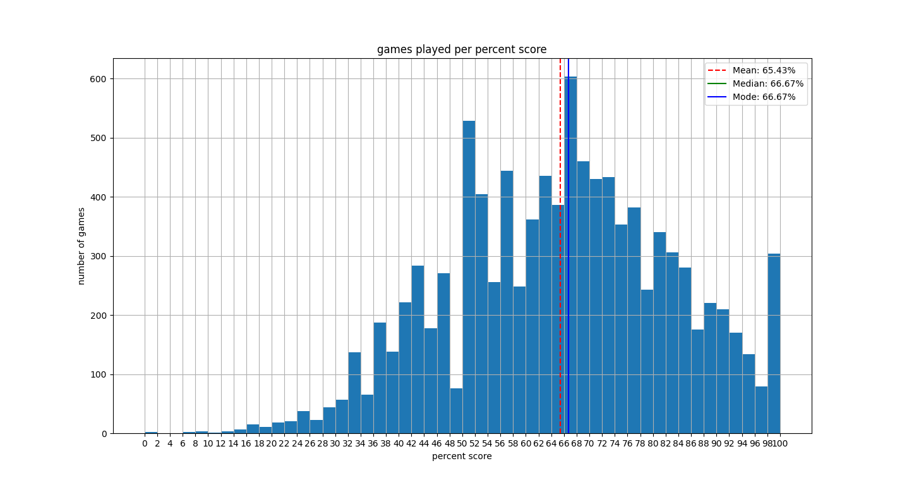
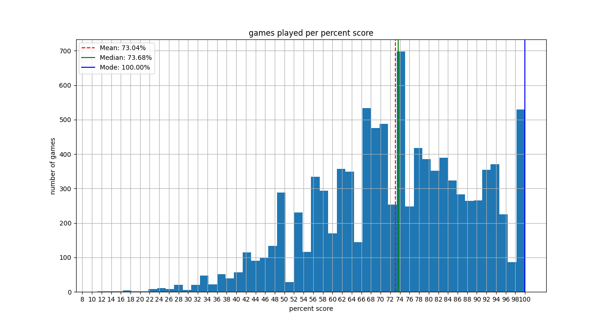
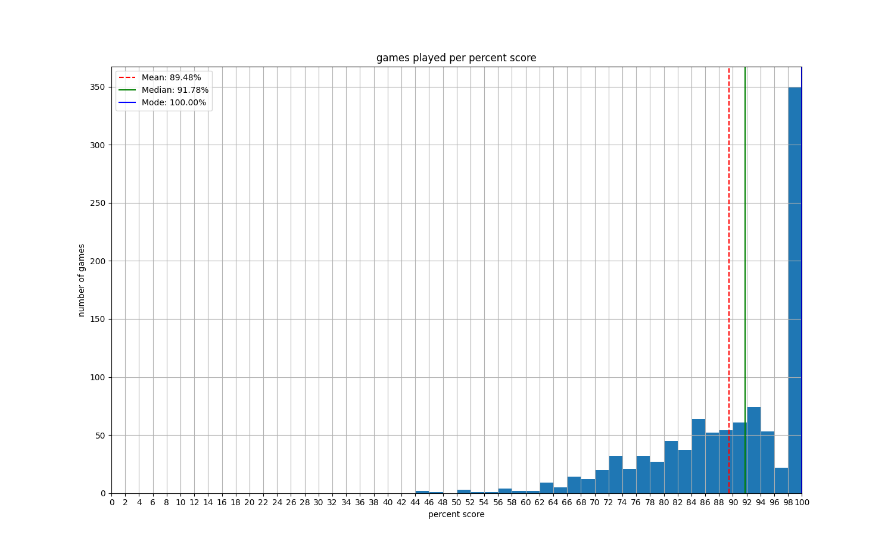

# Digit Party training writeup

Digit party as a game scales with complexity very very quickly, simply because of the number of available actions, as well as the number of possible digits. Because of this, I started with training a 3x3 game instead of the full 5x5 game that I first played.

## Simple Q-learning

### 3x3

For the 3x3 game, this works reasonably well. For a totally untrained agent (placing digits randomly), here's the distribution of scores over about ~100,000 games:

After training the simple q-agent on about 20,000,000 games, here is the resulting distribution playing 100,000 games:

While this is an impressive result, the resulting policy file is nearly 5 gigabytes, and for that reason I haven't uploaded it or stored it anywhere.

### 5x5

For the 5x5 game, using simple q-learning is pretty much intractable. There are just far too many state-action pairs to keep track of in a single policy file. It's theoretically doable, but I would need a lot of compute and memory to handle the training. I also think that it would take a few orders of magnitude more than 20,000,000 episodes to achieve a similar result as in the 3x3 case. Here's the distribution of scores of an untrained agent playing about 10,000 5x5 games:

## Deep Q-learning

Here's where deep q-learning comes into play. The idea is that after training, the neural network can output very similar policies that result from simple q-learning, but without all that memory overhead. This is still a work in progress to find the proper neural network architecture and hyperparameters.

### 3x3

#### Guessing a neural network architecture

I started with guessing some architecture and hyperparameters for the neural network, but found that while training, it was totally overfitting, and not learning properly at all. In many cases, the agent would have to fall back to a random action because the action it chose was actually invalid. So essentially, even after training, the agent wasn't much better than a random agent.

#### Finding optimal hyperparameters

Luckily, after training a simple q agent to play the 3x3 game, I have nearly 5 gigabytes of objective training data that can be used search for optimal hyperparameters. I "chunked" the 5 gigabytes of training data into 1000 chunks, and using 1% (10 chunks) to run a bayesian optimization algorithm to find optimal hyperparameters for the network. These hyperparameters were much better than my original guess at the network architecture and hyperparameters, though it's still not perfect.

For one agent, I took the training data from each of the 1000 chunks, and trained the neural network on each chunk incrementally. Here's the result of that agent playing 10,000 games:

For another agent, I trained it with the whole set of training data (all 1000 chunks). (However, I ran it through 200 epochs incrementally, by saving the network after 1 epoch for 200 iterations. Training locally isn't very resilient, so there's possibility of it glitching out during training, without saving the neural network weights. I also found that 200 epochs wasn't much better than running it through the recommended 42 epochs.) Here's the result of that agent playing 10,000 games:

Both agents clearly do better (averaging 70% score) than a totally untrained agent (which averages 50% score), though it still fails to live up to the agent trained with the simple q-learning method.

#### Back to deep Q-learning

The resulting hyperparameters are much more promising, so now I try to use them for the deep q-learning algorithm.

#### Actually making deep Q-learning work

My first deep q-learning attempt still failed, even with better network hyperparameters. I was borrowing too much from the supervised training path and hoping it would transfer cleanly, but it didn't work. The agent was not really training enough, it was wasting too much time around invalid moves, and the whole setup was just not matched well to the actual reinforcement learning problem. I'm a little surprised that adding a mask to avoid invalid moves improves the training so much. In theory it should be possible to punish invalid moves by giving it a negative reward, but I guess it wastes way too much time searching in that space.

With some help from Codex to dig through the failure modes, I reworked the deep q setup instead of just guessing again. The biggest changes were:

1. Invalid actions were masked during training and in the target calculation. This seems to have helped a lot. The network spent less time learning around moves that are not even legal.
2. Training schedule changes:
    - Training went from `5000` episodes to `200000` episodes
    - Replay went from huge and very infrequent updates (`minibatch_size=15041`, `steps_to_train_longterm=15041`) to small and regular updates (`minibatch_size=64`, `steps_to_train_longterm=4`)
    - Epsilon decay was slowed way down from `0.01` to `0.0001`
    - Target network syncing became much more frequent. The old setup just was not getting enough useful learning updates.
3. The network itself got simpler:
    - `epochs` per update went from `42` to `1`
    - The deep q network no longer predicts a scalar value representing the score, just the q-values it needs, to avoid training overhead. It may be possible to train the network to predict a scalar value representing the score at each state and still see similar results but I don't think that was necessary at this stage.
4. Better evaluation, checkpointing, and state tracking were added. That did not directly make the training better, but it made it much easier to see if the run was actually improving and save the best model when it did.
    - The evaluator runs every `2500` episodes by playing `500` games, which made it a lot easier to tell if training was actually getting better instead of just watching loss values or hoping for the best.
    - The best evaluation checkpoint is saved automatically, which is how I got the final best model result above.
    - State tracking uses a Bloom filter to estimate how many unique states the agent has seen without storing every single state exactly. That made it possible to track novelty during training without letting the tracking itself blow up in size.

After that, the result was a lot better. Here is the best 3x3 deep q model playing 1000 games:

The best checkpoint from this training run is [best_model_3x3_dqn_200k_run.weights.h5](./deepq_3x3_models/best_model_3x3_dqn_200k_run.weights.h5).

This is the first deep q result for Digit Party that actually feels strong instead of just experimental.
